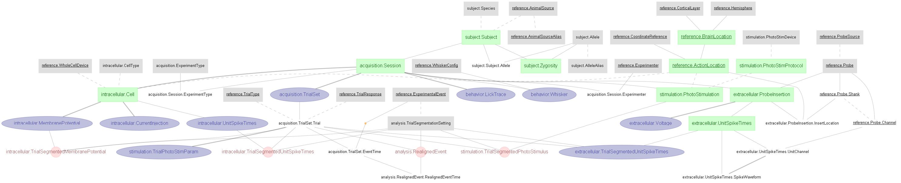

# Yu, Gutnisky et al., 2016 - A DataJoint example

### This directory a duplicate of the [DJ-NWB-Yu-Gutnisky-2016](https://github.com/datajoint-company/DJ-NWB-Yu-Gutnisky-2016) repository as part of the [DataJoint NWB Showcase](https://github.com/datajoint-company/DataJoint-NWB-showcase). Submit any issues to [DJ-NWB-Yu-Gutnisky-2016](https://github.com/datajoint-company/DJ-NWB-Yu-Gutnisky-2016).


This notebook presents data and results associated with the following papers:

>Jianing Yu, Diego A Gutnisky, S Andrew Hires & Karel Svoboda1. "Layer 4 fast-spiking interneurons filter thalamocortical signals during active somatosensation" (2016) Nat Neurosci (https://dx.doi.org/10.1038/nn.4412)

In this study, membrane potential and spikes recordings were performed ventral posteromedial nucleus (VPM) neurons and layer 4 (L4) neurons of the barrel cortex, during an object-locating with whiskers task. The study reported a movement-related suppression mechanism of the thalamocortical circuit. Specifically, the L4 fast-spiking interneurons, inherited from the sensory input driven VPM activity, suppressed movement-related activity of the L4 excitatory neurons. This movement-related suppression thus improved selectivity for touch-related information during active tactile sensation.

A ***DataJoint*** data pipeline has been constructed for this study, with the presented data ingested into this pipeline. This notebook demonstrates the queries, processing, and reproduction of several figures from the paper. From the pipeline, export capability to NWB 2.0 format is also available.

## About the data

The dataset comprises of membrane potential, extracellular recordings and spike sorted results of the mouse's VPM and L4 neurons a whisker-based object locating task. The behavior data includes detailed description of the trial structure (e.g. trial timing, trial instruction, trial response, etc.), lick trace data and a variety of whisker movement related tracking data: whisker angle, whisker curavture, touch times, etc. Trial information also includes optogenetic photostimulation details.

Original data shared here: http://crcns.org/data-sets/ssc/ssc-7

The data in original NWB 1 format (.nwb) have been ingested into a DataJoint data pipeline presented below. This notebook demonstrates the queries, processing, and reproduction of several figures from the paper.

Data are also exported into NWB 2.0 format. 

## Design DataJoint data pipeline 
This repository will contain the Python 3.6+ code of the DataJoint data pipeline design for this dataset, as well as scripts for data ingestions and visualization

## Conversion to NWB 2.0
This repository will contain the Python 3.6+ code to convert the DataJoint pipeline into NWB 2.0 format (See https://neurodatawithoutborders.github.io/)s
See NWB export code [here](../scripts/datajoint_to_nwb.py)

## Demonstration of the data pipeline
Data queries and usages are demonstrated in this [Jupyter Notebook](notebooks/Yu-Gutnisky-2016-examples.ipynb), where several figures from the paper are reproduced. 

## Data Pipeline Architecture


## Instruction to execute this pipeline

### Download original data 

After cloning this repository, download the original data. Once downloaded, you should find a data directory
named `data` containing several data subfolders: `L4E_loose_seal`, `L4E_whole_cell`, `L4E_whole_cell_ION_cut`,
 `L4FS_loose_seal`, `L4FS_loose_seal_ION_cut`, `L4FS_whole_cell`, `VPM_silicon_probe`. 
 
### Setup "dj_local_conf.json"

`dj_local_conf.json` is a configuration file for DataJoint, which minimally specifies the
 database connection information, as well as several other optional configurations.
 
 Create a new `dj_local_conf.json` at the root of your project directory (where you have this repository cloned),
  with the following format:
 
 ```json
{
    "database.host": "database_hostname",
    "database.user": "your_username_here",
	"database.password": "your_password_here",
    "database.port": 3306,
    "database.reconnect": true,
    "loglevel": "INFO",
    "safemode": true,
    "custom": {
	    "database.prefix": "yg2016_",
        "data_directory": ".../path_to_downloaded_data/data"
    }
}
```

Note: make sure to provide the correct database hostname, username and password.
 Then specify the path to the downloaded data directories (parent of all the data subfolders).

### Ingest data into the pipeline

On a new terminal, navigate to the root of your project directory, then execute the following commands:

```
python scripts/ingest_extracellular.py
```

```
python scripts/ingest_wholecell.py
```

### Mission accomplished!
You now have a functional pipeline up and running, with data fully ingested.
 You can explore the data, starting with the provided demo notebook.
 
From your project root, launch ***jupyter notebook***:
```
jupyter notebook
```

### Export to NWB 2.0
Data from this DataJoint pipeline can be exported in NWB 2.0 format using this [datajoint_to_nwb.py](../scripts/datajoint_to_nwb.py) script. 
To perform this export for all ingested data, specify the export location (e.g. `./data/exported_nwb2.0`), execute this command from the project root:

```
python scripts/datajoint_to_nwb.py ./data/exported_nwb2.0
```
