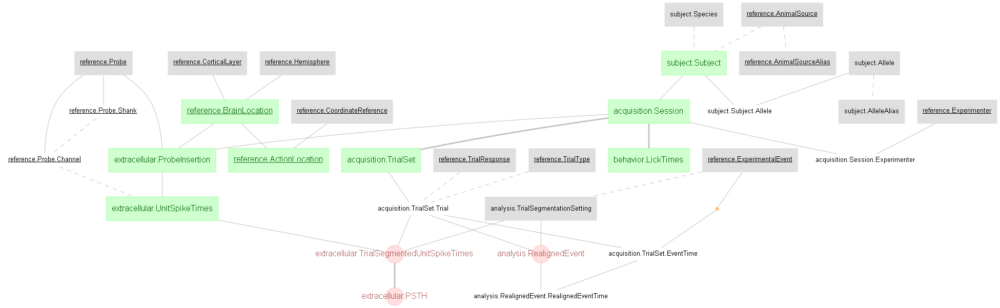

# Economo et al., 2018 - A DataJoint example

### This directory a duplicate of the [DJ-NWB-Economo-2018-](https://github.com/datajoint-company/DJ-NWB-Economo-2018) repository as part of the [DataJoint NWB Showcase](https://github.com/datajoint-company/DataJoint-NWB-showcase). Submit any issues to [DJ-NWB-Economo-2018-](https://github.com/datajoint-company/DJ-NWB-Economo-2018).


This notebook presents data and results associated with the following papers:

>Michael N. Economo, Sarada Viswanathan, Bosiljka Tasic, Erhan Bas, Johan Winnubst, Vilas Menon, Lucas T. Graybuck, Thuc Nghi Nguyen, Kimberly A. Smith, Zizhen Yao, Lihua Wang, Charles R. Gerfen, Jayaram Chandrashekar, Hongkui Zeng, Loren L. Looger & Karel Svoboda. "Distinct descending motor cortex
pathways and their roles in movement" (2018) Nature (https://doi.org/10.1038/s41586-018-0642-9)

The study identified two types of pyramidal track (PT) neuron in the mouse motor cortex, referred to as PT<sub>upper</sub> and PT<sub>lower</sub>. Further investigation using extracellular recordings in the anterior lateral motor cortex (ALM) during a delay-response task, the study revealed specialized roles for the two neuron types: i) PT<sub>upper</sub> neurons are preferentially involved in motor planning, ii) PT<sub>lower</sub> neurons are more involved in movement execution.  

A ***DataJoint*** data pipeline has been constructed for this study, with the presented data ingested into this pipeline. This notebook demonstrates the queries, processing, and reproduction of several figures from the paper. From the pipeline, export capability to ***NWB 2.0*** format is also available.

## About the data

The dataset comprises of extracellular recordings and spike sorted results of the mouse's ALM during a delay-response task. The behavior data includes detailed description of the trial structure (e.g. trial timing, trial instruction, trial response, etc.) and the timing of the lick events (e.g. lick left, lick right onset). 

Original data is publicly available at: doi: 10.25378/janelia.7007846

The data in original MATLAB format (.mat) have been ingested into a DataJoint data pipeline presented below. 

Data are also exported into NWB 2.0 format. See NWB export code [here](../scripts/datajoint_to_nwb.py)

## Design DataJoint data pipeline 
This repository contains the **Python 3.7** code of the DataJoint data pipeline design for this dataset, as well as scripts for data ingestions and visualization.
 


## Conversion to NWB 2.0
This repository contains the **Python 3.7** code to convert the DataJoint pipeline into NWB 2.0 format (See https://neurodatawithoutborders.github.io/)
Each NWB file represents one recording session. The conversion script can be found [here](scripts/datajoint_to_nwb.py)

## Demonstration of the data pipeline
Data queries and usages are demonstrated in this [Jupyter Notebook](notebooks/Economo-2018-examples.ipynb), where several figures from the paper are reproduced. 

## Instruction to execute this pipeline

### Download original data 

After cloning this repository, download the original data. Once downloaded, you should find a folder named `7007846` containing
 multiple subfolders. In which, the electrophysiology data is at `.../7007846/Ephys/Code/ProcessedData`
 
### Setup "dj_local_conf.json"

`dj_local_conf.json` is a configuration file for DataJoint, which minimally specifies the
 database connection information, as well as several other optional configurations.
 
 Create a new `dj_local_conf.json` at the root of your project directory (where you have this repository cloned),
  with the following format:
 
 ```json
{
    "database.host": "database_hostname",
    "database.user": "your_username_here",
	"database.password": "your_password_here",
    "database.port": 3306,
    "database.reconnect": true,
    "loglevel": "INFO",
    "safemode": true,
    "custom": {
	    "database.prefix": "economo2018_",
        "data_directory": ".../7007846/Ephys/Code/ProcessedData"
    }
}
```

Note: make sure to provide the correct database hostname, username and password.
 Then specify the path to the downloaded data directories (fill in the `...` portion).

### Ingest data into the pipeline

On a new terminal, navigate to the root of your project directory, then execute the following command:

```
python scripts/ingestion.py
```

### Mission accomplished!
You now have a functional pipeline up and running, with data fully ingested.
 You can explore the data, starting with the provided demo notebook.
 
From your project root, launch ***jupyter notebook***:
```
jupyter notebook
```

### Export to NWB 2.0
Data from this DataJoint pipeline can be exported in NWB 2.0 format using this [datajoint_to_nwb.py](../scripts/datajoint_to_nwb.py) script. 
To perform this export for all ingested data, specify the export location (e.g. `./data/exported_nwb2.0`), execute this command from the project root:

```
python scripts/datajoint_to_nwb.py ./data/exported_nwb2.0
```


