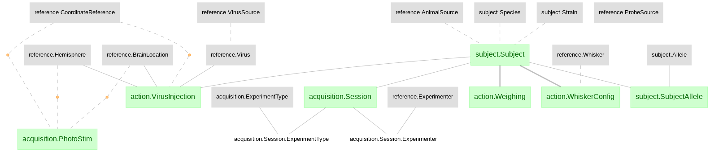

# Gao et al., 2018

### This directory a duplicate of the [DJ-NWB-Gao-2018](https://github.com/datajoint-company/DJ-NWB-Gao-2018) repository as part of the [DataJoint NWB Showcase](https://github.com/datajoint-company/DataJoint-NWB-showcase). Submit any issues to [DJ-NWB-Gao-2018](https://github.com/datajoint-company/DJ-NWB-Gao-2018).

This repository sets up the data pipeline for Gao et al., 2018. **A cortico-cerebellar loop for motor planning**, replicates a subset of the major results (Figure 2c, 3e-f, and 4i), and exports the data into nwb files.

Link to the publication:  https://www.nature.com/articles/s41586-018-0633-x

Link to the original data: http://crcns.org/data-sets/motor-cortex/alm-4/

Link to the exported NWB files: https://drive.google.com/drive/u/1/folders/1I9Sur9TRzts_u35OP_XEFlMYnKBJfCPS

Access to view the notebook: https://nbviewer.jupyter.org/github/vathes/gao2018/blob/master/notebooks/Gao-2018-examples.ipynb?flush_cache=true


This study revealed a cortical-cerebellar loop for motor planning with electrophysiological recording and optogenetics perturbations, within a behavioral paradigm of delayed somatosensory discrimination task. The two brain areas studied were anterior lateral motor cortex (ALM), and cerebellar nuclei (CN). The study first shows that both ALM and CN are responsive during the delay period (Fig 2), and are selective to trials in one location, suggesting their roles in motor planning. Inibibition of either ALM or CN disrupted the selectivity of the other area (Fig 3). Finally, the study compared the effect of activating Dentate and Fastigial cerebellar nuclei on the discriminability of the ALM neurons (Fig 4), and found that Fastigial nucleus is more important for ALM discriminability during the delay period.

## Combined schemas:




## Instrunctions on setting up the pipeline and notebook locally.

1. This repo is set up with docker, install docker and docker-compose.

2. Set up your local mysql server.

3. `git clone https://github.com/vathes/gao2018.git`

4. Inside the repository, open a file called `.env` and paste in the following information and save the file.
    ```
    DJ_HOST=host.docker.internal
    DJ_USER=YOUR_USER_NAME
    DJ_PASS=YOUR_PASSWORD
    ```
5. Create a directory called `data`, and download the data from the link http://crcns.org/data-sets/motor-cortex/alm-4/, put the two folders `datafile` and `datafile 2` inside the `data` directory

6. Run the bash script with command `bash gao2018.sh`
    The whole script takes a few hours to run. After it's done, you will find nwb files in the directory `data/NWB 2.0`

7. To run the notebook, open your browser and put in `http://localhost:8892/notebooks/Gao-2018-examples.ipynb`
