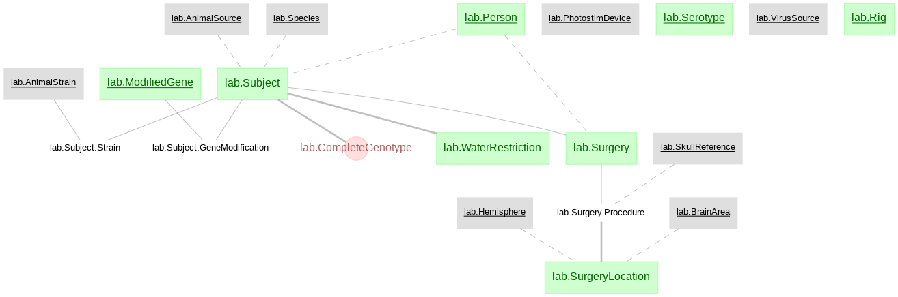
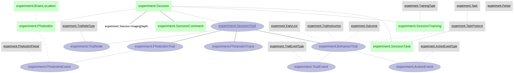
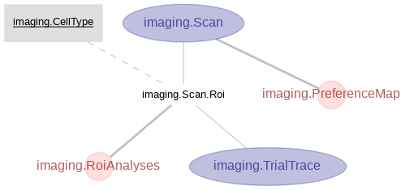

# Li et al., 2015b

### This directory a duplicate of the [DJ-NWB-Li-2015b](https://github.com/datajoint-company/DJ-NWB-Li-2015b) repository as part of the [DataJoint NWB Showcase](https://github.com/datajoint-company/DataJoint-NWB-showcase). Submit any issues to [DJ-NWB-Li-2015b](https://github.com/datajoint-company/DJ-NWB-Li-2015b).

This repository sets up the data pipeline corresponding to Figure 4 in Li et al., (2015). **"A motor cortex circuit for motor planning and movement."** and provides the notebook for the figure replication.

Link to the publication: https://doi.org/10.1038/nature14178

Link to the original data: https://dx.doi.org/10.6080/K0MS3QNT

Link to the exported NWB files: https://drive.google.com/drive/u/1/folders/1ZiyqvKBiu1yjr7UTR4RNo6Kcs0Wdf67o

Access to view the notebook: https://nbviewer.jupyter.org/github/shenshan/Li-2015b/blob/master/notebooks/Li-2015b-examples.ipynb

This study revealed the flow of information within motor cortex circuits involved in converting preparatory activity into movements. One important part of the motor cortex is known as anterior later motor cortex (ALM), which has been shown to involve in planing directed licking. Projection neurons in ALM include two major classes: intratelencephalic (IT) neurons that project to other cortical areas and pyramidal tract (PT) neurons that project out of the cortex, including to motor-related areas in the brainstem. Results in Figure 4, in particular, characterized the selectivity and preference of PT and IT neurons in ALM L5 on the population level.


## Schema structure

The `lab` schema:



The `experiment` schema:



The `imaging` schema:



## Instrunctions on setting up the pipeline and notebook locally.

1. This repo is set up with docker, install docker and docker-compose.

2. Set up your local mysql server.

3. `git clone https://github.com/vathes/li-2015b.git`

4. Inside the repository, open a file called `.env` and paste in the following information and save the file.
    ```
    DJ_HOST=host.docker.internal
    DJ_USER=YOUR_USER_NAME
    DJ_PASS=YOUR_PASSWORD
    ```
5. Create a directory called `data`, and download the data from the link https://dx.doi.org/10.6080/K0MS3QNT, put the meta data file into `data/meta_data` and the recorded data into `data/datastruction`.

6. Run the bash script with command `bash li2015b.sh`
    The whole script takes a few hours to run. After it's done, you will find nwb files in the directory `data/NWB 2.0`

7. To run the notebook, open your browser and put in `http://localhost:8810/notebooks/Li-2015b-examples.ipynb`
